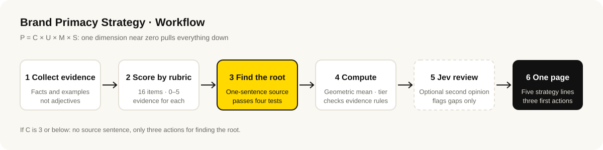

# BaoCanMou · Brand Primacy Strategy

[中文](README.md) · **English**

[](CHANGELOG.md)
[](NOTICE.md)

An AI Skill for business owners, strategists and designers. It turns the operating facts of a brand into a one-page strategy using the Brand Primacy theory (P = C × U × M × S): where the root is, which dimension is weakest, and which three things to do first.

The Skill works in Chinese. Reports are written in the language of the request.

## Who it is for

- **You cannot say what makes you different**: the product is fine, but you cannot explain how you differ from competitors.
- **You spent money and nothing moved**: you paid for design and promotion and want to know which link is broken.
- **A tempting opportunity is on the table**: a price cut, a recipe change, franchising, a new channel. You want to know whether it harms the root of the brand.
- **Before brand design starts**: decide what to amplify before deciding how to say it or draw it.

## What it does

- **Scores from evidence**: four dimensions (Core value and culture, User connection, Market sensitivity, Social role and value), 16 checkpoints, each needing written evidence. Owner statements are capped at 4 of 5; the top score needs customer quotes or data.
- **Finds the weakest dimension**: the four multiply, so one near zero pulls everything down. Fix the weakest before amplifying anything.
- **States the source in one sentence**: recognized from high-scoring evidence and checked against four tests (true, wanted, different, lasting). When evidence does not hold, it says "not established" instead of inventing a story.
- **Delivers one page**: why, who we are and are not, what to say, what to do, how to calibrate, plus three first actions and a not-doing list.
- **Checks a decision**: is this action changing the expression, or moving the root?
- **Quarterly retest**: same rubric, compare what changed.

## Example

A fictional neighbourhood bakery. Full report (Chinese): [examples/suihe-bakery-report.md](examples/suihe-bakery-report.md)

> **Conclusion**: Primacy index 6.1/10 (medium). The root is real and customers recognize it. The weak dimension is market sensitivity (3.5): what competitors do is still guesswork. See them clearly before amplifying.
>
> **Source**: Bread is made from flour the same day and never sold the next day, so parents trust it as breakfast for their children. (To be verified: whether competitors cannot do the same.)

A second example shows the output when the source is not established: no source sentence, only three actions for finding the root.

## Workflow



## Install

Clone into your host's skill directory:

| Host | Command |
|---|---|
| Claude Code | `git clone https://github.com/baocanmou/baocanmou-brand-primacy.git ~/.claude/skills/baocanmou-brand-primacy` |
| Codex | `git clone https://github.com/baocanmou/baocanmou-brand-primacy.git ~/.agents/skills/baocanmou-brand-primacy` |

The scoring script uses only the Python 3 standard library. Without Python, the Skill computes by hand and says so.

## Usage

```text
Use Brand Primacy to build a one-page brand strategy. We are … (describe your business, customers and competitors)
```

```text
A distributor wants us to extend shelf life from 45 days to 12 months to enter national supermarkets. Use Brand Primacy to check whether we should.
```

```text
Here is our assessment from three months ago and the current situation. Run a retest.
```

Specific material helps: customer reviews, chat logs, sales data. Where you cannot give an example, the Skill marks the item "to be verified" and does not fill it in for you.

## Optional: second opinion from Jev

With `TYPESAFE_API_KEY` set, the Skill adds one step: the Jev model from [TypeSafe](https://docs.typesafe.ai) re-reads each piece of evidence independently, lists items where its reading differs from the score, and checks whether the source sentence could be said by any competitor and whether the three actions are concrete. It only raises differences and never changes scores.

The Skill is complete without a key. This step sends the diagnosis JSON to the TypeSafe API; do not enable it for material that must stay local.

## Limits

- Scores are judgments based on the material you provide. They are not market research and do not predict sales or growth.
- It does not invent customer quotes, sales figures or competitor information.
- It does not write finished slogans or produce logos, visuals or packaging. It decides what to amplify.
- Claims about food function, health, franchising or returns need your own legal check.

## FAQ

**Why multiply the four dimensions instead of adding them?**
Adding implies a strength can make up for a weakness. In practice it cannot: a brand without a core value is exposed faster the more it advertises.

**How is the overall index computed?**
Each dimension is 0–10. The index is their geometric mean, also 0–10. Any dimension at 3 or below puts the brand in the weak tier.

**My shop is small. Can the social dimension be scored?**
Yes. Treating staff well, paying suppliers on time and being honest with neighbours all count.

**How does this relate to positioning?**
Positioning answers which place you hold in the customer's mind. Brand Primacy answers why you can hold it.

## Version

Current version 0.1.0. See [CHANGELOG.md](CHANGELOG.md).

## License and credit

The Brand Primacy theory was written by Yi Huiting. The registered copyright owner is Nanchang BaoCanMou Brand Planning Co., Ltd. (registration no. 赣作登字-2023-A-00132773). This project is copyrighted by the same company and published under CC BY-NC 4.0: free for personal study and for diagnosing your own brand; written permission is required to use it in paid services for third parties or inside paid products. See [NOTICE.md](NOTICE.md).

Keep this credit when you use or cite it: Brand Primacy theory · Yi Huiting · BaoCanMou.

## Other BaoCanMou open-source projects

| Project | What it does |
|---|---|
| [Restaurant Slogans: 10 Methods, 3 Picks](https://github.com/baocanmou/baocanmou-restaurant-slogan) | One restaurant tagline per method from ten masters, then three recommendations |
| [Plans into Presentations](https://github.com/baocanmou/baocanmou-plan-to-ppt) | Turns briefs and research into an editable, source-checked proposal deck |
| [BCM GEO Outcome Engine](https://github.com/baocanmou/bcm-geo-optimizer) | Diagnoses brand mentions, citations and recommendations in AI search |
| [Open GEO SEO Console](https://github.com/baocanmou/open-geo-seo-console) | Self-hosted SEO and GEO monitoring console |
| [BaoCanMou AI Skill Center](https://github.com/baocanmou/baocanmou-ai-skill-center) | Desktop app that catalogs local AI skills and links them to AI tools |

## About BaoCanMou

BaoCanMou (包参谋) — Nanchang BaoCanMou Brand Planning Co., Ltd. — is a brand strategy and design company founded in 2012 in Nanchang, Jiangxi, China. We provide brand positioning, logo and visual identity, packaging, brand space and communication content, mainly for restaurants, chain stores, packaged food and regional specialty brands. Founder: Yi Huiting. Website: [www.bcmsj.com](https://www.bcmsj.com).

We work positioning first, design second. These tools come from work we repeat in client projects; we write the judgment criteria down so AI can follow the same standard.
