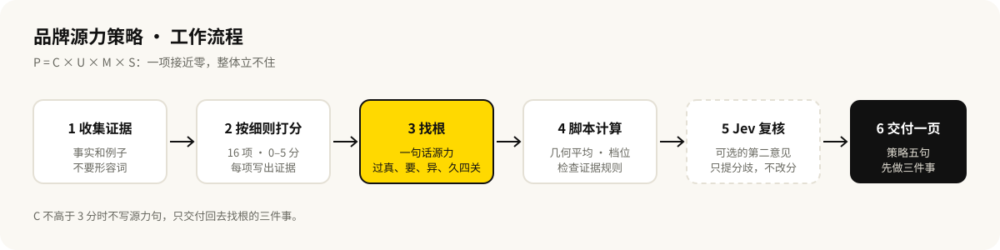

# 包参谋·品牌源力策略

**中文** · [English](README.en.md)

[](CHANGELOG.md)
[](NOTICE.md)
[](https://gitee.com/yihuiting/baocanmou-brand-primacy)

给经营者、策划和设计师用的 AI Skill：把一个品牌的经营事实，按品牌源力理论（P = C × U × M × S）整理成一页策略，说清根在哪、短在哪、先做哪三件事。

## 适合谁、什么时候用

- **说不清自己的特色**：产品不差，但讲不出和同行有什么不一样。
- **钱花了没效果**：做过设计、投过推广，生意没有起色，想知道问题出在哪一环。
- **面前有一个诱人的机会**：降价、换配方、开加盟、做新渠道，想知道会不会伤到品牌的根。
- **做品牌设计之前**：先确定该放大什么，再谈怎么说、怎么画。

## 能做什么

- **按证据打分**：核心价值、用户连接、市场敏感度、社会角色四个维度，16 个检查项，每项都要写出证据。老板自己说的封顶 4 分，要拿满分得有顾客原话或数据。
- **找出最短的一项**：四项相乘，一项接近零，整体就立不住。先补短板，再谈放大。
- **写出一句话源力**：从高分证据里认出来，过“真、要、异、久”四关。证据撑不起来时，直接说“未成立”，不替品牌编故事。
- **给出一页策略**：为什么、是谁不是谁、说什么、做什么、怎么校准，加上先做的三件事和现在不做的事。
- **校验一个动作**：判断它是在换表达，还是在动根。
- **季度复测**：同一把尺子再量一次，看哪项变了。

## 效果示例

虚构的社区面包店“穗禾烘焙”，完整报告见 [examples/suihe-bakery-report.md](examples/suihe-bakery-report.md)：

> **结论**：源力指数 6.1/10（中）。根是真的，顾客也认，短在市场这一项（3.5 分）：对手在做什么，至今只靠猜。先把对手看清楚，再谈放大。
>
> **源力**：面包当天从面粉做起、不过夜，所以家长敢买给孩子当早餐。（待验证：对手是否做不到还没核实）

另一个示例“轻气轻食”展示了源力未成立时的交付：不写源力句，只给回去找根的三件事。

## 工作流程



## 安装

这是标准格式的 AI Skill（`SKILL.md`），国内外常用的 AI 工具都能用。按你用的工具选一种：

| 你用的工具 | 安装方法 |
|---|---|
| Claude Code | `git clone https://github.com/baocanmou/baocanmou-brand-primacy.git ~/.claude/skills/baocanmou-brand-primacy` |
| Codex、Kimi Code CLI、文心快码 Comate | `git clone https://github.com/baocanmou/baocanmou-brand-primacy.git ~/.agents/skills/baocanmou-brand-primacy` |
| 通义千问 Qwen Code | `git clone https://github.com/baocanmou/baocanmou-brand-primacy.git ~/.qwen/skills/baocanmou-brand-primacy` |
| TRAE | `git clone https://github.com/baocanmou/baocanmou-brand-primacy.git ~/.trae/skills/baocanmou-brand-primacy` |
| 豆包、扣子 | 从 [Releases](https://github.com/baocanmou/baocanmou-brand-primacy/releases/latest) 下载 `baocanmou-brand-primacy-skill-v版本号.zip`，在“技能”页上传 |
| DeepSeek、Kimi、豆包、通义千问、文心的聊天窗口 | 打开 [PROMPT.md](PROMPT.md)，复制全文作为第一条消息发出（也可以作为附件上传），再讲你的品牌情况 |

GitHub 打不开时，把地址换成国内镜像 `https://gitee.com/yihuiting/baocanmou-brand-primacy.git`。Windows 下把 `~` 换成 `%USERPROFILE%`。各工具的技能目录可能调整，以它们的最新文档为准。

计分脚本只用 Python 3 标准库，不需要安装依赖。没有 Python 或在聊天窗口里使用时，会按规则手算并注明“手算”。

## 使用方法

直接对 AI 说：

```text
用品牌源力帮我做一页品牌策略。我们是……（把你的生意、顾客、对手的情况讲一讲）
```

```text
有经销商让我们把保质期从 45 天改成 12 个月，就能铺进全国商超。用品牌源力看看该不该做。
```

```text
这是三个月前的源力评估，这是现在的情况，帮我复测一次。
```

资料越具体越好：顾客评价、聊天记录、销售数据都有用。讲不出例子的地方，Skill 会标为“待核实”，不会替你补。

## 可选：Jev 第二意见复核

设置环境变量 `TYPESAFE_API_KEY` 后，Skill 会多做一步：让 [TypeSafe](https://docs.typesafe.ai) 的 Jev 模型独立重读每条证据，列出和打分差距较大的项，并检查源力句是不是同行也能说、三件事是不是足够具体。它只提意见，不改分数。

不设置密钥也能完整使用。这一步会把诊断 JSON 发到 TypeSafe 的接口；资料不便外发时不要启用。

## 边界

- 分数是依据你提供的资料做出的判断，不是市场调研，不预测销量和增长。
- 不虚构顾客原话、销售数据和竞品信息。
- 不写广告语成稿，不出 Logo、视觉和包装设计。这里只定“放大什么”。
- 涉及食品功效、医疗健康、招商加盟的说法，需要你自己对照法规核实。

## 常见问题

**为什么四项要相乘，而不是相加？**
相加意味着强项可以补短板。实际经营里补不了：没有核心价值的品牌，传播做得越多，越快被看穿。

**综合分怎么算？**
四项各 0–10 分，取几何平均，结果仍是 0–10 分。任何一项不高于 3 分，直接按“弱”处理。

**我的店很小，社会角色这一项是不是没法打分？**
可以。把员工带好、不拖供应商的货款、对街坊诚实，都算。

**源力和定位是什么关系？**
定位回答“在顾客心里占什么位置”，源力回答“凭什么占得住”。先有源力，定位才有依据。

## 版本与更新

当前版本 0.2.0，见 [CHANGELOG.md](CHANGELOG.md)。

## 许可与署名

“品牌源力”理论由易慧庭撰写，著作权人为南昌包参谋品牌策划有限公司（赣作登字-2023-A-00132773）。本项目版权归南昌包参谋品牌策划有限公司所有，按 CC BY-NC 4.0 公开：个人学习和诊断自己的品牌免费；用于对外收费服务或放进收费产品，需要书面授权。详见 [NOTICE.md](NOTICE.md)。

使用或引用时保留署名：品牌源力理论 · 易慧庭 · 包参谋。

## 包参谋其他开源项目

| 项目 | 做什么 |
|---|---|
| [餐饮广告语·十法三选](https://github.com/baocanmou/baocanmou-restaurant-slogan) | 按 10 种名家方法各写一条餐饮广告语，比较后推荐 3 条 |
| [策划资料变 PPT](https://github.com/baocanmou/baocanmou-plan-to-ppt) | 把简报和调研做成有来源、可编辑的提案 PPT |
| [GEO 效果优化](https://github.com/baocanmou/bcm-geo-optimizer) | 诊断品牌在 AI 搜索中的提及、引用和推荐，按证据排改进任务 |
| [Open GEO SEO Console](https://github.com/baocanmou/open-geo-seo-console) | 可自行部署的 SEO 与 GEO 监控后台 |
| [包参谋 AI 技能中心](https://github.com/baocanmou/baocanmou-ai-skill-center) | 盘点本机 AI Skill 并统一连接多种 AI 工具的桌面应用 |

## 关于包参谋

包参谋，全称南昌包参谋品牌策划有限公司，2012 年创立于江西南昌，提供品牌定位、Logo/VI 设计、包装设计、品牌空间与传播内容服务，主要服务餐饮、连锁门店、食品快消和地方特色品牌。创始人易慧庭。官网：[www.bcmsj.com](https://www.bcmsj.com)。

我们先定位，后设计。这些开源工具来自我们在实际项目里反复做的工作，我们把判断标准写清楚，让 AI 按同样的标准做事。
